# Lab1：高效包处理平台 OpenNetVM 的原理与优化
## 1.性能测试
- 当NF为bridge，pktgen rate为10%时，OpenNetVM稳定时的吞吐量随packet size的变化如下图：
    
    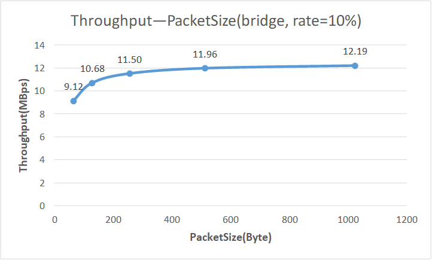
    

图1：rate=10%时，吞吐量和包大小的关系

    
    可以看到，随着包的大小逐渐增大，吞吐量逐渐增大，并最终达到阈值，趋于稳定。
    
    我们可以认为Pktgen的每秒发送包的数量相同，即PPS（packet per second）相同，随着包的大小增大，吞吐量（throughput = PPS * PacketSize）不断增大。
    
    但是，如果按照吞吐量的计算公式来看，包的大小翻倍，吞吐量也应该翻倍；同时，观察图2不难发现，rate=100%时，接收包的吞吐量最大值远高于rate=10%所能达到的吞吐量。这说明仅有Pktgen的发包吞吐量达到了阈值，可以理解为将rate设置为10%时，同时限制了PPS和最大发包吞吐量。
    
- 当NF为bridge， pktgen rate为100%时，OpenNetVM稳定时的吞吐量随packet size的变化如下图：

    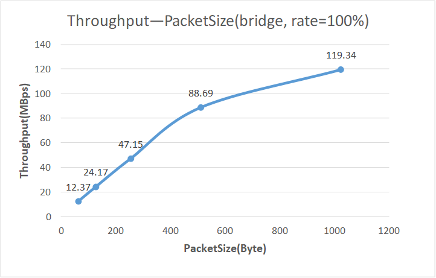
    

图2：rate=100%时，吞吐量和包大小的关系

    当packet size $\le$ 512时，随着包的大小翻倍，吞吐量近似翻倍；当packet
    size $>$ 512时，发包或者收包的性能开始达到瓶颈，不再继续翻倍，吞吐量增长率降低。当packet size=1024时，rate=100%的吞吐量近似为rate=10%的10倍。

- 对比图1和图2，不难发现，当rate=10%时，Pktgen同时对发包的PPS和最大吞吐量进行了限制，使得图1更快达到阈值；而rate=100%时，由于对发包最大吞吐量没有限制，收包吞吐量近似呈线性增长。

## 2.服务链测试

当包的大小为64bytes，NF的数量分别为1，2，3时，OpenNetVM的吞吐量随NF数量的关系如下图：
    
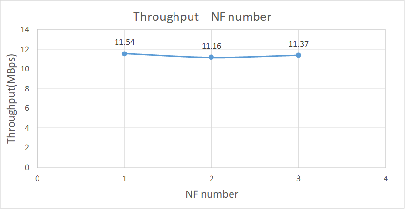

图3：packet size=64时，吞吐量和NF数量的关系

随着NF的增多，OpenNetVM的吞吐量几乎不发生变化（吞吐量没有随着NF增多略微变小，可能是两台虚拟机同时运行时，运行资源分配波动导致的）。这部分和论文中基本相同，OpenNetVM为每个NF分配一个线程，每个线程都有专用的核心分配。同时，基于DPDK的轮询模式在NF之间传递数据，避免了内核开销。这些使得OpenNetVM在运行多个NF时，吞吐量几乎不变。

## 3.流表维护
**basic_monitor不收包**：令packet size=64，pktgen rate=100%，packet count=32，便会发生basic_monitor一个包也有没收到的情况（packet size应尽量小，不宜过大；pktgen rate应尽量快，不宜过慢） 。结果如图4：

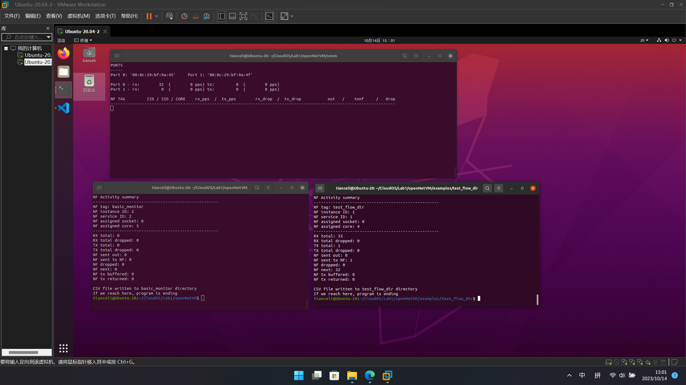

图4：basic_monitor没有收到包

**原因**：通过对源码的阅读发现，在test_flow_dir的main函数中，在onvm_nflib_run()中进行了packet_handler的调用，继续阅读不难发现，在创建的线程main_loop中，线程会首先读取缓存中的最多PACKET_READ_SIZE（=32）个包，如图5：

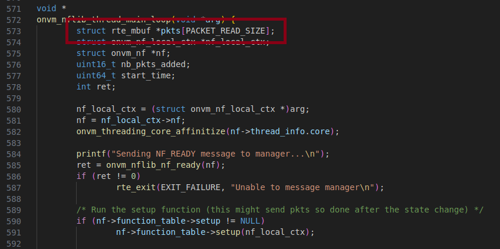

图5：main_loop中读取的最大packet size

在main_loop的onvm_nflib_dequeue_packets中对读取的包依次调用了packet_handler进行处理，如图6。对于读到的包，只有第一个被用于设置flow table的entry，其余的包都被设置为ONVM_NF_ACTION_NEXT，并在后续的处理中drop掉。因此，所有在这一次批处理中被读取到的包，都没有被发送到basic_monitor。

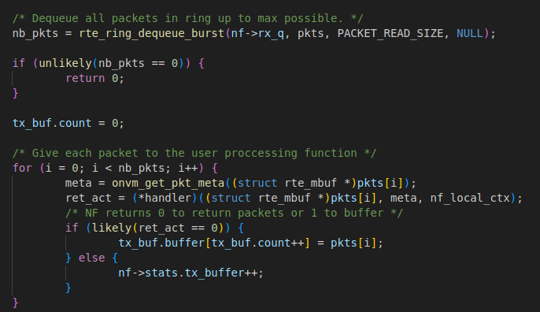

图6：调用packet_handler处理读取的包

有一点比较奇怪，按照我们的理解，test_flow_dir中的RX total应该是32，NF next的数量应该是31。但实际上，如图4，RX total=33，NF next=32。这里推测，可能是test_flow_dir将第一次处理的包又发给了自己，使得其TX total=1，但并未在源码中找到转发给自己的相关部分。

**修改**：根据上面的原因，我们可以直接将被标记为ONVM_NF_ACTION_NEXT的包标记为ONVM_NF_ACTION_TONF，并设置对应的destination，即可将这些包发送给basic_monitor，如图7：

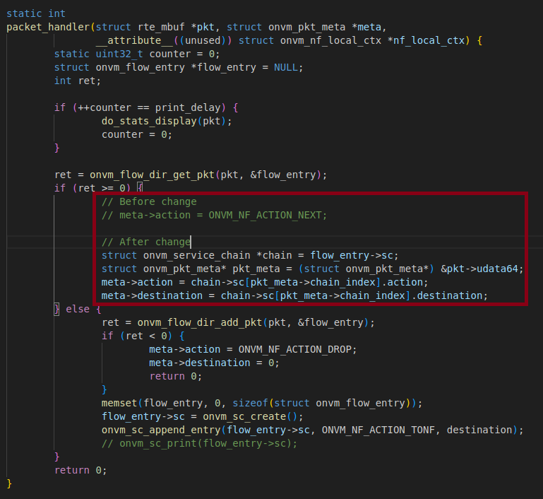

图7：test_flow_dir中packet_handler的修改

修改后的结果如图8，通过查找pkt的meta data获取chain index，修改action和destination，此时basic_monitor已经能正常收到包。

图8：修改后的basic_monitor的收包情况

## 4.拓展

**思路**：为了加快flow table的访问，最直观的想法是增加一层cache，避免在每次查找entry时重新计算hash value，这里希望通过最多访问策略（MRU，Most Recently Used）实现。但实际上，在统计entry被访问次数时，没有考虑到“最近一段时间”这个因素，算是一个简单版本实现。

我的想法是，在entry中增加一个hit_cnt变量，用来表示该entry被命中的次数（被搜索的次数）；在flow table中保存一个cache_entry，用来保存hit_cnt最大的entry，即被访问次数最多的entry。这样，通过packet查找这个entry时，就不需要重新计算hash value，也避免了查找过程中发生哈希碰撞。

**代码**：具体步骤如下：

1. 首先，在test_flow_dir的packet_handler中新建一个flow entry时，设置flow_entry->hit_cnt = 1
2. 在onvm/onvm_mgr/main.c中的rx_thread_main()函数会处理接收的包，通过onvm_pkt_process_rx_batch->onvm_flow_dir_get_pkt可以找到获取flow entry的函数onvm_ft_lookup_pkt，我们需要在这里判断缓存中是否存在需要查找的entry.
3. 如果有cache_entry，直接使用；否则，到flow table中查找，并更新cache_entry。这里判断是否存在cache_entry，是通过比较5元组key来判断的，因此，在flow table中新引入变量cache_key用于比较

**效果**：上述的具体实现可以参考具体代码。之后在packet size=64，pktgen rate=100%的情况下，server chain为test_flow_dir->basic_monitor的环境下实现，测试OpenNetVM的吞吐量。采用优化前，rx_pps如下：

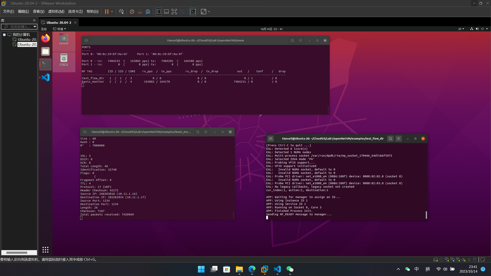

图9：OpenNetVM修改前的rx_pps

优化后，rx_pps如下：

图10：OpenNetVM修改后的rx_pps

事实上，两者差距并不明显。可能的原因有：
1. flow table中的条目过少，查找时不会发生hash碰撞，自然也不需要cache；
2. 比较entry的时间，不一定少于计算hash value的事件；
3. 最多访问策略不一定是最优的，可以采用LRU。但在本项目中基本相同。

## 5.附录

图11：第1题-rate10_size64

图12：第1题-rate10_size128

图13：第1题-rate10_size256

图14：第1题-rate10_size512

图15：第1题-rate10_size1024

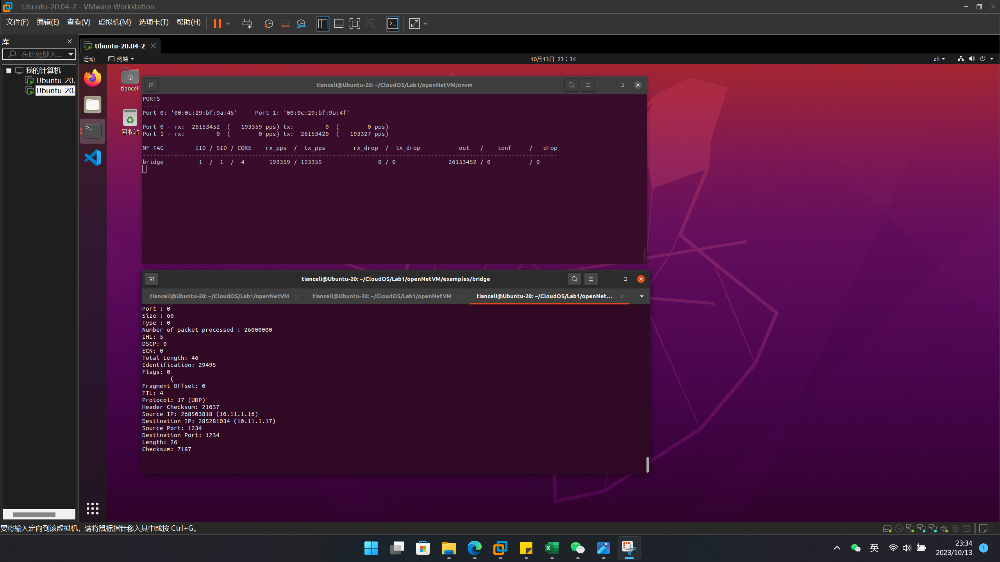

图16：第1题-rate100_size64

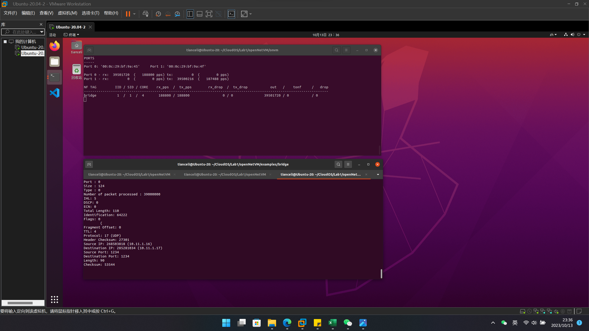

图17：第1题-rate100_size128

图18：第1题-rate100_size256

图19：第1题-rate100_size512

图20：第1题-rate100_size1024

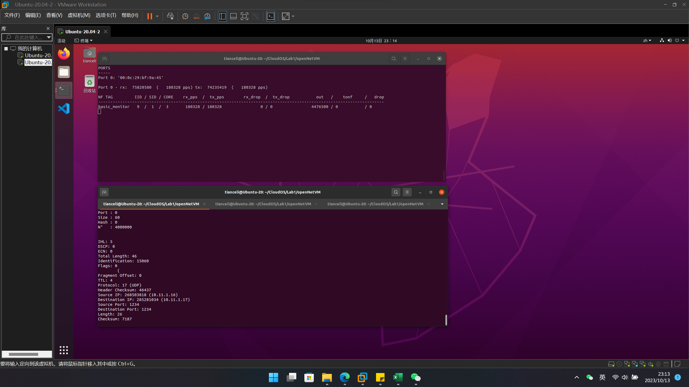

图21：第2题-NF=1

图22：第2题-NF=2

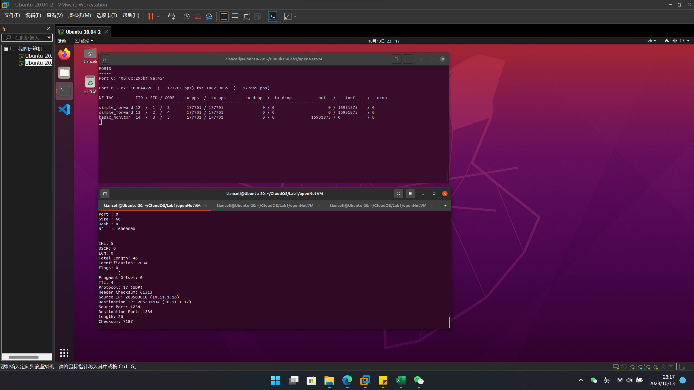

图23：第2题-NF=3

