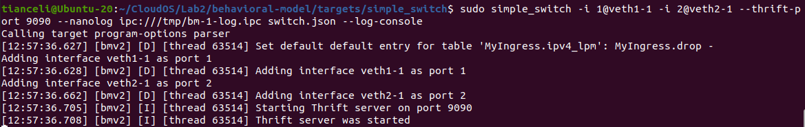
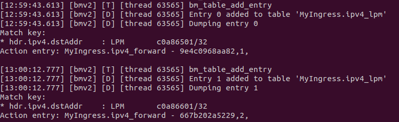
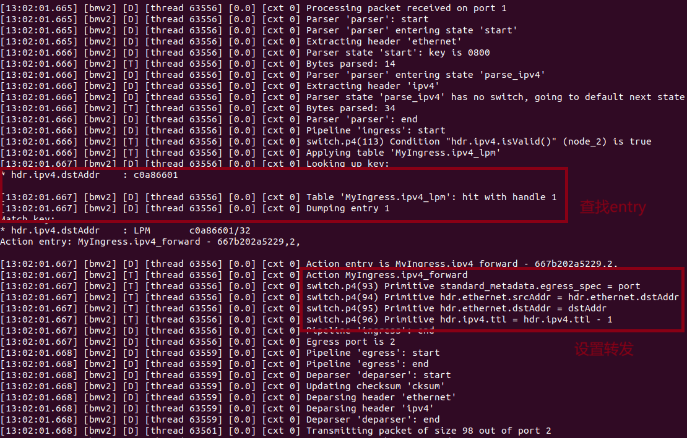
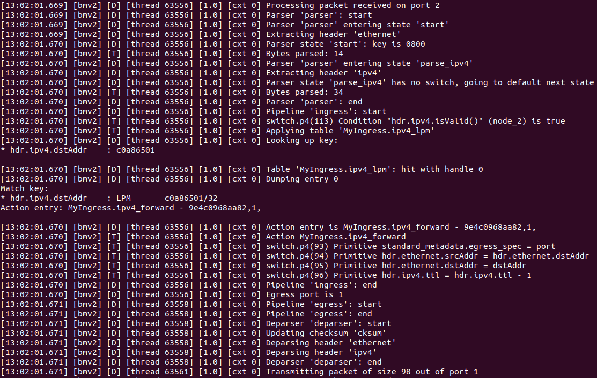

# Lab2：P4上⼿实验

## 一、了解P4语言
在这部分中，我了解到了P4的基础内容，包括以下内容：

1. P4的三段式结构：Parser -> Match-Action Pipline -> Deparser
    
    + Parser：根据用户自定义的header类型，解析网络包
    + Match-Action Pipline：主要包括Ingress和Engress部分。按照之后的实验来看，主要是根据预定义的规则（如flow table）修改网络包的内容
    + Deparser：根据之前的修改，重新生成新的网络包，之前需要根据修改的内容重新计算checksum

2. P4的基本数据结构和语法：这里主要记录两个问题

    + header和struct的区别：事实上，在阅读过程中，除了部分操作和可定义类型不同外，没有感觉到过多的区别。最大的区别应该是，header类型主要用于对数据包进行解析，具有validity field，其定义应当符合数据包中的数据排列；struct用于组织和存储目的，没有特定的解析需求。
    + transition：该语句用于确定下一个解析状态（即，跳转位置），并且主要在Parser阶段使用，配合select语句可以方便的实现分支、循环等拓扑结构

3. P4中的Table：涉及逻辑处理部分，感觉上类似于流表或者路由表，通过设置好的key值，定义在Ingress阶段执行怎样的Action（即，如何处理包），而Ingress中的控制流也可以通过预先定义的一个或多个Table实现。

## 二、搭建简单的P4实验环境

这部分通过bmv2搭建了一个简单的交换机，基本没有问题

## 三、开始实验

在该阶段，通过定义P4过程和设置table的方式，实现了简单的交换机

1. 启动simple_switch后，首先设置了预定义的table—ipv4_lpm，并将veth1-1和veth2-1分别设置为port 1和2
   
   

2. 启动Thrift，根据ipv4.dstAddr设置table的entry，先后设置192.168.101.1/32、192.168.102.1/32和对应转发的mac地址，设置结果如下：
   
   

3. 从ns1 ping ns2
   
   + 在发送阶段，按照parser->ingress->engress->deparser的流程进行。需要注意的是，在ingress阶段，switch首先根据目标地址在table中找到了entry 1，并执行ipv4_forward，将发送到192.168.102.1的包由veth2-1进行转发，并减少包的生存时间（ttl），完成一次路由；
    
     
  
   + 在ns2的响应阶段，也是同理，根据目标地址查找到table中的entry 0，再由veth1-1进行转发

     
