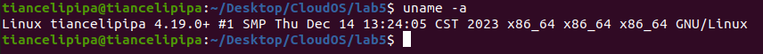
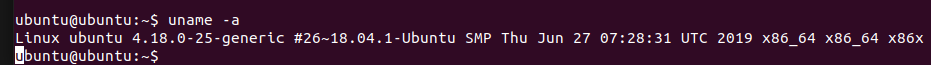
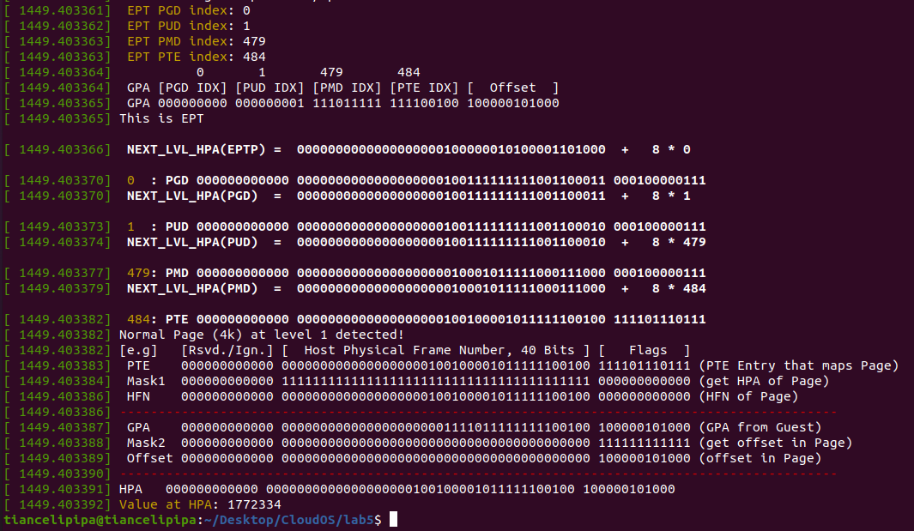
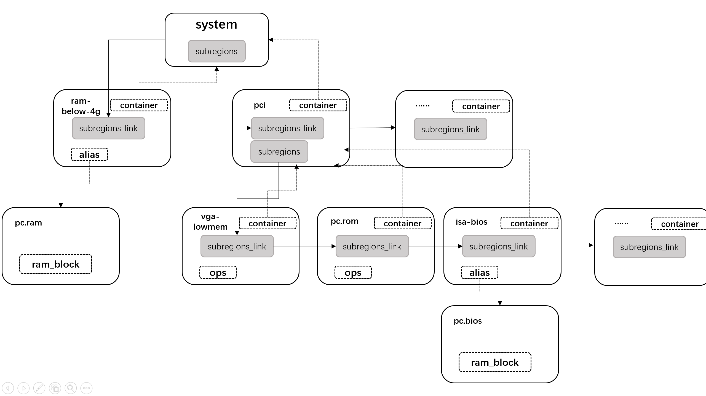

# Lab5-part2：内存虚拟化

### 问题

1. 虚拟内存到物理内存的映射是如何通过页表实现的？（参考教材 3.2.1 节）
   
    操作系统将虚拟内存和物理内存划分为固定大小的页，一般为4KB（也有2MB/1GB大小的大页），页表记录虚拟页号（VFN）和物理页号（PFN）之间的对应关系。
    
    通常，页表采用多层结构，32位架构采用10+10形式的二级页表，64位架构则采用9+9+9+9形式的四级页表。通过增加内存访问次数的方式，使为使用的查询表项不出现在内存中，大大减少了内存占用。

    页表的查询由CPU的MMU负责，CPU将页表的基地址放入指定寄存器，MMU中的页表爬取器即可将VA翻译成PFN，左移12位后与VA的低12为相加即得到PA。当MMU无法完成地址翻译时，会向CPU发送缺页异常，内核视情况进行页表创建、物理内存分配、内存换入换出等。MMU还可以通过TLB缓存VA到PA的映射，避免查询页表造成的内存访问，还有页表缓存等机制。

2. 请阐述影子页表（SPT）和扩展页表（EPT）各自的优缺点（参考教材 3.2.2-3.2.3 节）​
   
    - 影子页表
      - 优点
        
        1. SPT实现相对简单，不需要额外的硬件支持（如Intel VT提供的具有交叉查询GPT和EPT功能的扩展MMU），仅需在软件层维护SPT即可
        2. 当GPT很少被修改时，SPT可以表现出较好的性能
        3. 和EPT相比，SPT的查询需要更少的内存访问次数，在TLB未命中时表现更优

      - 缺点

        1. 由于SPT和GPT一一对应，因此，每创建一个GPT，就要同时维护一个SPT，带来较多额外的内存开销
        2. 当GPT被修改时，为了保证SPT和GPT的同步，需要Hypervisor根据GPT修改SPT，并将TLB中的缓存相关项清除，因此，客户机每次修改GPT，都会带来巨大的性能开销
     
    - 扩展页表
      - 优点

        1. 相较于SPT，EPT需要更少的内存开销。因为，EPT避免保存SPT中的很多重复信息，仅保存GPA到HPA的映射关系，一个客户机仅需一个EPT，减少了内存开销
        2. 相较于SPT，当GPT经常被修改时，对EPT没有影响，因此，近乎没有性能损失
     
      - 缺点

        1. EPT需要硬件的支持，灵活性稍差，尽管大部分主流架构都支持。实现也相对复杂，需要考虑双层页表
        2. 相较于SPT，在TLB未命中时，双层页表需要更多次的内存访问，带来更多的性能开销

3. 请根据你的理解解释 QEMU是如何通过 KVM 接口建立 EPT 的（参考教材第三章 图 3-12 ）
   
    QEMU在启动客户机时，会检测CPU是否支持EPT，并设置标志位；之后为每个vCPU分配一个VMCS，并设置EPTP指向空的EPT；然后，将VMCS和EPT传递给KVM，让KVM负责EPT的更新；在QEMU给客户机分配内存时，通过KVM接口通知KVM相关模块，添加相应的映射关系，即GPA到HPA的转换。根据图3-12，整个流程大概如下：

    1. 在QEMU的main函数中，依次执行CPU执行环境（`cpu_exec_init_all`）和内存映射初始化（`memory_map_init`）
    2. 内存映射初始化包含两部分，一部分是内存区域初始化（`memory_region_init`），另一部分是地址空间的初始化（`address_space_init`）。建立EPT发生在地址空间初始化部分
    3. 在地址空间初始化中，`address_space_init`会调用`address_space_update_topology`，其中包括`generate_memory_topology`和`address_space_set_flatview`两个步骤，这些函数负责生成和设置内存拓扑结构。
    4. 内存拓扑被更新之后，通过调用`kvm_region_add`来添加一个新的内存区域。 `kvm_region_add`函数进一步调用`kvm_set_phys_mem`和`kvm_set_user_memory_region`来设置物理内存和用户内存区域。 `kvm_set_user_memory_region`函数内部通过`kvm_vm_ioctl`函数调用ioctl系统调用，并传递`KVM_SET_USER_MEMORY_REGION`作为请求码，向KVM模块提交用户内存区域的设置请求。 
    5. KVM模块接收到这个请求后，会在宿主机的物理内存中分配相应的内存区域，并建立起EPT，以完成对虚拟机内存空间的映射。

### 实验过程

1. 下载Linux v4.19 内核，替换`arch/x86/kvm/`下的文件，编译并替换内核，结果如下：



2. 建立客户机



3. 查看地址翻译过程
     - 客户机页表翻译过程

        ```
        # gpt_dump.txt文件内容
        gpt_dump: loading out-of-tree module taints kernel.
        gpt_dump: module verification failed: signature and/or required key missing - taa
        inting kernel
        Value at GVA: 1772334
          GPT PGD index: 277
          GPT PUD index: 372
          GPT PMD index: 479
          GPT PTE index: 484
                    277       372       479       484
          GVA [PGD IDX] [PUD IDX] [PMD IDX] [PTE IDX] [  Offset  ]
          GVA 100010101 101110100 111011111 111100100 100000101000
        
          NEXT_LVL_GPA(CR3)  =  0000000000000000000001111010000011100010  +  8 * 277
        
          277: PGD 000000000000 0000000000000000000001100111011101100011 000001100111
          NEXT_LVL_GPA(PGD)  =  0000000000000000000001100111011101100011  +  8 * 372
        
          372: PUD 000000000000 0000000000000000000001100111011101100111 000001100111
          NEXT_LVL_GPA(PUD)  =  0000000000000000000001100111011101100111  +  8 * 479
        
          479: PMD 000000000000 0000000000000000000000110110010101101010 000001100011
          NEXT_LVL_GPA(PMD)  =  0000000000000000000000110110010101101010  +  8 * 484
        
          484: PTE 100000000000 0000000000000000000001111011111111100100 000001100011
          GPA            =      0000000000000000000001111011111111100100 100000101000
        ```
      - 宿主机EPT翻译过程：
    
        

4. 打印 QEMU MemoryRegion 树​

    ```
    address-space: memory
      0000000000000000-ffffffffffffffff (prio 0, i/o): system
        0000000000000000-000000007fffffff (prio 0, i/o): alias ram-below-4g @pc.ram 0000000000000000-000000007fffffff
        0000000000000000-ffffffffffffffff (prio -1, i/o): pci
          00000000000a0000-00000000000bffff (prio 1, i/o): vga-lowmem
          00000000000c0000-00000000000dffff (prio 1, rom): pc.rom
          00000000000e0000-00000000000fffff (prio 1, i/o): alias isa-bios @pc.bios 0000000000020000-000000000003ffff
          00000000fd000000-00000000fdffffff (prio 1, ram): vga.vram
          00000000fe000000-00000000fe003fff (prio 1, i/o): virtio-pci
            00000000fe000000-00000000fe000fff (prio 0, i/o): virtio-pci-common
            00000000fe001000-00000000fe001fff (prio 0, i/o): virtio-pci-isr
            00000000fe002000-00000000fe002fff (prio 0, i/o): virtio-pci-device
            00000000fe003000-00000000fe003fff (prio 0, i/o): virtio-pci-notify
          00000000fe004000-00000000fe007fff (prio 1, i/o): virtio-pci
            00000000fe004000-00000000fe004fff (prio 0, i/o): virtio-pci-common
            00000000fe005000-00000000fe005fff (prio 0, i/o): virtio-pci-isr
            00000000fe006000-00000000fe006fff (prio 0, i/o): virtio-pci-device
            00000000fe007000-00000000fe007fff (prio 0, i/o): virtio-pci-notify
          00000000feb80000-00000000feb9ffff (prio 1, i/o): e1000-mmio
          00000000febb0000-00000000febb0fff (prio 1, i/o): vga.mmio
            00000000febb0400-00000000febb041f (prio 0, i/o): vga ioports remapped
            00000000febb0500-00000000febb0515 (prio 0, i/o): bochs dispi interface
            00000000febb0600-00000000febb0607 (prio 0, i/o): qemu extended regs
          00000000febb1000-00000000febb1fff (prio 1, i/o): virtio-blk-pci-msix
            00000000febb1000-00000000febb101f (prio 0, i/o): msix-table
            00000000febb1800-00000000febb1807 (prio 0, i/o): msix-pba
          00000000febb2000-00000000febb2fff (prio 1, i/o): virtio-blk-pci-msix
            00000000febb2000-00000000febb201f (prio 0, i/o): msix-table
            00000000febb2800-00000000febb2807 (prio 0, i/o): msix-pba
          00000000fffc0000-00000000ffffffff (prio 0, rom): pc.bios
        00000000000a0000-00000000000bffff (prio 1, i/o): alias smram-region @pci 00000000000a0000-00000000000bffff
        00000000000c0000-00000000000c3fff (prio 1, i/o): alias pam-ram @pc.ram 00000000000c0000-00000000000c3fff [disabled]
        00000000000c0000-00000000000c3fff (prio 1, i/o): alias pam-pci @pc.ram 00000000000c0000-00000000000c3fff [disabled]
        00000000000c0000-00000000000c3fff (prio 1, i/o): alias pam-rom @pc.ram 00000000000c0000-00000000000c3fff
        00000000000c0000-00000000000c3fff (prio 1, i/o): alias pam-pci @pci 00000000000c0000-00000000000c3fff [disabled]
        00000000000c4000-00000000000c7fff (prio 1, i/o): alias pam-ram @pc.ram 00000000000c4000-00000000000c7fff [disabled]
        00000000000c4000-00000000000c7fff (prio 1, i/o): alias pam-pci @pc.ram 00000000000c4000-00000000000c7fff [disabled]
        00000000000c4000-00000000000c7fff (prio 1, i/o): alias pam-rom @pc.ram 00000000000c4000-00000000000c7fff
        00000000000c4000-00000000000c7fff (prio 1, i/o): alias pam-pci @pci 00000000000c4000-00000000000c7fff [disabled]
        00000000000c8000-00000000000cbfff (prio 1, i/o): alias pam-ram @pc.ram 00000000000c8000-00000000000cbfff [disabled]
        00000000000c8000-00000000000cbfff (prio 1, i/o): alias pam-pci @pc.ram 00000000000c8000-00000000000cbfff [disabled]
        00000000000c8000-00000000000cbfff (prio 1, i/o): alias pam-rom @pc.ram 00000000000c8000-00000000000cbfff
        00000000000c8000-00000000000cbfff (prio 1, i/o): alias pam-pci @pci 00000000000c8000-00000000000cbfff [disabled]
        00000000000cb000-00000000000cdfff (prio 1000, i/o): alias kvmvapic-rom @pc.ram 00000000000cb000-00000000000cdfff
        00000000000cc000-00000000000cffff (prio 1, i/o): alias pam-ram @pc.ram 00000000000cc000-00000000000cffff [disabled]
        00000000000cc000-00000000000cffff (prio 1, i/o): alias pam-pci @pc.ram 00000000000cc000-00000000000cffff [disabled]
        00000000000cc000-00000000000cffff (prio 1, i/o): alias pam-rom @pc.ram 00000000000cc000-00000000000cffff
        00000000000cc000-00000000000cffff (prio 1, i/o): alias pam-pci @pci 00000000000cc000-00000000000cffff [disabled]
        00000000000d0000-00000000000d3fff (prio 1, i/o): alias pam-ram @pc.ram 00000000000d0000-00000000000d3fff [disabled]
        00000000000d0000-00000000000d3fff (prio 1, i/o): alias pam-pci @pc.ram 00000000000d0000-00000000000d3fff [disabled]
        00000000000d0000-00000000000d3fff (prio 1, i/o): alias pam-rom @pc.ram 00000000000d0000-00000000000d3fff
        00000000000d0000-00000000000d3fff (prio 1, i/o): alias pam-pci @pci 00000000000d0000-00000000000d3fff [disabled]
        00000000000d4000-00000000000d7fff (prio 1, i/o): alias pam-ram @pc.ram 00000000000d4000-00000000000d7fff [disabled]
        00000000000d4000-00000000000d7fff (prio 1, i/o): alias pam-pci @pc.ram 00000000000d4000-00000000000d7fff [disabled]
        00000000000d4000-00000000000d7fff (prio 1, i/o): alias pam-rom @pc.ram 00000000000d4000-00000000000d7fff
        00000000000d4000-00000000000d7fff (prio 1, i/o): alias pam-pci @pci 00000000000d4000-00000000000d7fff [disabled]
        00000000000d8000-00000000000dbfff (prio 1, i/o): alias pam-ram @pc.ram 00000000000d8000-00000000000dbfff [disabled]
        00000000000d8000-00000000000dbfff (prio 1, i/o): alias pam-pci @pc.ram 00000000000d8000-00000000000dbfff [disabled]
        00000000000d8000-00000000000dbfff (prio 1, i/o): alias pam-rom @pc.ram 00000000000d8000-00000000000dbfff
        00000000000d8000-00000000000dbfff (prio 1, i/o): alias pam-pci @pci 00000000000d8000-00000000000dbfff [disabled]
        00000000000dc000-00000000000dffff (prio 1, i/o): alias pam-ram @pc.ram 00000000000dc000-00000000000dffff [disabled]
        00000000000dc000-00000000000dffff (prio 1, i/o): alias pam-pci @pc.ram 00000000000dc000-00000000000dffff [disabled]
        00000000000dc000-00000000000dffff (prio 1, i/o): alias pam-rom @pc.ram 00000000000dc000-00000000000dffff
        00000000000dc000-00000000000dffff (prio 1, i/o): alias pam-pci @pci 00000000000dc000-00000000000dffff [disabled]
        00000000000e0000-00000000000e3fff (prio 1, i/o): alias pam-ram @pc.ram 00000000000e0000-00000000000e3fff [disabled]
        00000000000e0000-00000000000e3fff (prio 1, i/o): alias pam-pci @pc.ram 00000000000e0000-00000000000e3fff [disabled]
        00000000000e0000-00000000000e3fff (prio 1, i/o): alias pam-rom @pc.ram 00000000000e0000-00000000000e3fff
        00000000000e0000-00000000000e3fff (prio 1, i/o): alias pam-pci @pci 00000000000e0000-00000000000e3fff [disabled]
        00000000000e4000-00000000000e7fff (prio 1, i/o): alias pam-ram @pc.ram 00000000000e4000-00000000000e7fff [disabled]
        00000000000e4000-00000000000e7fff (prio 1, i/o): alias pam-pci @pc.ram 00000000000e4000-00000000000e7fff [disabled]
        00000000000e4000-00000000000e7fff (prio 1, i/o): alias pam-rom @pc.ram 00000000000e4000-00000000000e7fff
        00000000000e4000-00000000000e7fff (prio 1, i/o): alias pam-pci @pci 00000000000e4000-00000000000e7fff [disabled]
        00000000000e8000-00000000000ebfff (prio 1, i/o): alias pam-ram @pc.ram 00000000000e8000-00000000000ebfff
        00000000000e8000-00000000000ebfff (prio 1, i/o): alias pam-pci @pc.ram 00000000000e8000-00000000000ebfff [disabled]
        00000000000e8000-00000000000ebfff (prio 1, i/o): alias pam-rom @pc.ram 00000000000e8000-00000000000ebfff [disabled]
        00000000000e8000-00000000000ebfff (prio 1, i/o): alias pam-pci @pci 00000000000e8000-00000000000ebfff [disabled]
        00000000000ec000-00000000000effff (prio 1, i/o): alias pam-ram @pc.ram 00000000000ec000-00000000000effff
        00000000000ec000-00000000000effff (prio 1, i/o): alias pam-pci @pc.ram 00000000000ec000-00000000000effff [disabled]
        00000000000ec000-00000000000effff (prio 1, i/o): alias pam-rom @pc.ram 00000000000ec000-00000000000effff [disabled]
        00000000000ec000-00000000000effff (prio 1, i/o): alias pam-pci @pci 00000000000ec000-00000000000effff [disabled]
        00000000000f0000-00000000000fffff (prio 1, i/o): alias pam-ram @pc.ram 00000000000f0000-00000000000fffff [disabled]
        00000000000f0000-00000000000fffff (prio 1, i/o): alias pam-pci @pc.ram 00000000000f0000-00000000000fffff [disabled]
        00000000000f0000-00000000000fffff (prio 1, i/o): alias pam-rom @pc.ram 00000000000f0000-00000000000fffff
        00000000000f0000-00000000000fffff (prio 1, i/o): alias pam-pci @pci 00000000000f0000-00000000000fffff [disabled]
        00000000fec00000-00000000fec00fff (prio 0, i/o): kvm-ioapic
        00000000fed00000-00000000fed003ff (prio 0, i/o): hpet
        00000000fee00000-00000000feefffff (prio 4096, i/o): kvm-apic-msi
    
    address-space: I/O
      0000000000000000-000000000000ffff (prio 0, i/o): io
        0000000000000000-0000000000000007 (prio 0, i/o): dma-chan
        0000000000000008-000000000000000f (prio 0, i/o): dma-cont
        0000000000000020-0000000000000021 (prio 0, i/o): kvm-pic
        0000000000000040-0000000000000043 (prio 0, i/o): kvm-pit
        0000000000000060-0000000000000060 (prio 0, i/o): i8042-data
        0000000000000061-0000000000000061 (prio 0, i/o): pcspk
        0000000000000064-0000000000000064 (prio 0, i/o): i8042-cmd
        0000000000000070-0000000000000071 (prio 0, i/o): rtc
          0000000000000070-0000000000000070 (prio 0, i/o): rtc-index
        000000000000007e-000000000000007f (prio 0, i/o): kvmvapic
        0000000000000080-0000000000000080 (prio 0, i/o): ioport80
        0000000000000081-0000000000000083 (prio 0, i/o): dma-page
        0000000000000087-0000000000000087 (prio 0, i/o): dma-page
        0000000000000089-000000000000008b (prio 0, i/o): dma-page
        000000000000008f-000000000000008f (prio 0, i/o): dma-page
        0000000000000092-0000000000000092 (prio 0, i/o): port92
        00000000000000a0-00000000000000a1 (prio 0, i/o): kvm-pic
        00000000000000b2-00000000000000b3 (prio 0, i/o): apm-io
        00000000000000c0-00000000000000cf (prio 0, i/o): dma-chan
        00000000000000d0-00000000000000df (prio 0, i/o): dma-cont
        00000000000000f0-00000000000000f0 (prio 0, i/o): ioportF0
        0000000000000170-0000000000000177 (prio 0, i/o): ide
        00000000000001ce-00000000000001d1 (prio 0, i/o): vbe
        00000000000001f0-00000000000001f7 (prio 0, i/o): ide
        0000000000000376-0000000000000376 (prio 0, i/o): ide
        0000000000000378-000000000000037f (prio 0, i/o): parallel
        00000000000003b4-00000000000003b5 (prio 0, i/o): vga
        00000000000003ba-00000000000003ba (prio 0, i/o): vga
        00000000000003c0-00000000000003cf (prio 0, i/o): vga
        00000000000003d4-00000000000003d5 (prio 0, i/o): vga
        00000000000003da-00000000000003da (prio 0, i/o): vga
        00000000000003f1-00000000000003f5 (prio 0, i/o): fdc
        00000000000003f6-00000000000003f6 (prio 0, i/o): ide
        00000000000003f7-00000000000003f7 (prio 0, i/o): fdc
        00000000000003f8-00000000000003ff (prio 0, i/o): serial
        00000000000004d0-00000000000004d0 (prio 0, i/o): kvm-elcr
        00000000000004d1-00000000000004d1 (prio 0, i/o): kvm-elcr
        0000000000000510-0000000000000511 (prio 0, i/o): fwcfg
        0000000000000514-000000000000051b (prio 0, i/o): fwcfg.dma
        0000000000000600-000000000000063f (prio 0, i/o): piix4-pm
          0000000000000600-0000000000000603 (prio 0, i/o): acpi-evt
          0000000000000604-0000000000000605 (prio 0, i/o): acpi-cnt
          0000000000000608-000000000000060b (prio 0, i/o): acpi-tmr
        0000000000000700-000000000000073f (prio 0, i/o): pm-smbus
        0000000000000cf8-0000000000000cfb (prio 0, i/o): pci-conf-idx
        0000000000000cf9-0000000000000cf9 (prio 1, i/o): piix3-reset-control
        0000000000000cfc-0000000000000cff (prio 0, i/o): pci-conf-data
        0000000000005658-0000000000005658 (prio 0, i/o): vmport
        000000000000ae00-000000000000ae13 (prio 0, i/o): acpi-pci-hotplug
        000000000000af00-000000000000af0b (prio 0, i/o): acpi-mem-hotplug
        000000000000afe0-000000000000afe3 (prio 0, i/o): acpi-gpe0
        000000000000c000-000000000000c07f (prio 1, i/o): virtio-pci
        000000000000c080-000000000000c0ff (prio 1, i/o): virtio-pci
        000000000000c100-000000000000c13f (prio 1, i/o): e1000-io
        000000000000c140-000000000000c14f (prio 1, i/o): piix-bmdma-container
          000000000000c140-000000000000c143 (prio 0, i/o): piix-bmdma
          000000000000c144-000000000000c147 (prio 0, i/o): bmdma
          000000000000c148-000000000000c14b (prio 0, i/o): piix-bmdma
          000000000000c14c-000000000000c14f (prio 0, i/o): bmdma
    
    address-space: cpu-memory-0
      0000000000000000-ffffffffffffffff (prio 0, i/o): system
        0000000000000000-000000007fffffff (prio 0, i/o): alias ram-below-4g @pc.ram 0000000000000000-000000007fffffff
        0000000000000000-ffffffffffffffff (prio -1, i/o): pci
          00000000000a0000-00000000000bffff (prio 1, i/o): vga-lowmem
          00000000000c0000-00000000000dffff (prio 1, rom): pc.rom
          00000000000e0000-00000000000fffff (prio 1, i/o): alias isa-bios @pc.bios 0000000000020000-000000000003ffff
          00000000fd000000-00000000fdffffff (prio 1, ram): vga.vram
          00000000fe000000-00000000fe003fff (prio 1, i/o): virtio-pci
            00000000fe000000-00000000fe000fff (prio 0, i/o): virtio-pci-common
            00000000fe001000-00000000fe001fff (prio 0, i/o): virtio-pci-isr
            00000000fe002000-00000000fe002fff (prio 0, i/o): virtio-pci-device
            00000000fe003000-00000000fe003fff (prio 0, i/o): virtio-pci-notify
          00000000fe004000-00000000fe007fff (prio 1, i/o): virtio-pci
            00000000fe004000-00000000fe004fff (prio 0, i/o): virtio-pci-common
            00000000fe005000-00000000fe005fff (prio 0, i/o): virtio-pci-isr
            00000000fe006000-00000000fe006fff (prio 0, i/o): virtio-pci-device
            00000000fe007000-00000000fe007fff (prio 0, i/o): virtio-pci-notify
          00000000feb80000-00000000feb9ffff (prio 1, i/o): e1000-mmio
          00000000febb0000-00000000febb0fff (prio 1, i/o): vga.mmio
            00000000febb0400-00000000febb041f (prio 0, i/o): vga ioports remapped
            00000000febb0500-00000000febb0515 (prio 0, i/o): bochs dispi interface
            00000000febb0600-00000000febb0607 (prio 0, i/o): qemu extended regs
          00000000febb1000-00000000febb1fff (prio 1, i/o): virtio-blk-pci-msix
            00000000febb1000-00000000febb101f (prio 0, i/o): msix-table
            00000000febb1800-00000000febb1807 (prio 0, i/o): msix-pba
          00000000febb2000-00000000febb2fff (prio 1, i/o): virtio-blk-pci-msix
            00000000febb2000-00000000febb201f (prio 0, i/o): msix-table
            00000000febb2800-00000000febb2807 (prio 0, i/o): msix-pba
          00000000fffc0000-00000000ffffffff (prio 0, rom): pc.bios
        00000000000a0000-00000000000bffff (prio 1, i/o): alias smram-region @pci 00000000000a0000-00000000000bffff
        00000000000c0000-00000000000c3fff (prio 1, i/o): alias pam-ram @pc.ram 00000000000c0000-00000000000c3fff [disabled]
        00000000000c0000-00000000000c3fff (prio 1, i/o): alias pam-pci @pc.ram 00000000000c0000-00000000000c3fff [disabled]
        00000000000c0000-00000000000c3fff (prio 1, i/o): alias pam-rom @pc.ram 00000000000c0000-00000000000c3fff
        00000000000c0000-00000000000c3fff (prio 1, i/o): alias pam-pci @pci 00000000000c0000-00000000000c3fff [disabled]
        00000000000c4000-00000000000c7fff (prio 1, i/o): alias pam-ram @pc.ram 00000000000c4000-00000000000c7fff [disabled]
        00000000000c4000-00000000000c7fff (prio 1, i/o): alias pam-pci @pc.ram 00000000000c4000-00000000000c7fff [disabled]
        00000000000c4000-00000000000c7fff (prio 1, i/o): alias pam-rom @pc.ram 00000000000c4000-00000000000c7fff
        00000000000c4000-00000000000c7fff (prio 1, i/o): alias pam-pci @pci 00000000000c4000-00000000000c7fff [disabled]
        00000000000c8000-00000000000cbfff (prio 1, i/o): alias pam-ram @pc.ram 00000000000c8000-00000000000cbfff [disabled]
        00000000000c8000-00000000000cbfff (prio 1, i/o): alias pam-pci @pc.ram 00000000000c8000-00000000000cbfff [disabled]
        00000000000c8000-00000000000cbfff (prio 1, i/o): alias pam-rom @pc.ram 00000000000c8000-00000000000cbfff
        00000000000c8000-00000000000cbfff (prio 1, i/o): alias pam-pci @pci 00000000000c8000-00000000000cbfff [disabled]
        00000000000cb000-00000000000cdfff (prio 1000, i/o): alias kvmvapic-rom @pc.ram 00000000000cb000-00000000000cdfff
        00000000000cc000-00000000000cffff (prio 1, i/o): alias pam-ram @pc.ram 00000000000cc000-00000000000cffff [disabled]
        00000000000cc000-00000000000cffff (prio 1, i/o): alias pam-pci @pc.ram 00000000000cc000-00000000000cffff [disabled]
        00000000000cc000-00000000000cffff (prio 1, i/o): alias pam-rom @pc.ram 00000000000cc000-00000000000cffff
        00000000000cc000-00000000000cffff (prio 1, i/o): alias pam-pci @pci 00000000000cc000-00000000000cffff [disabled]
        00000000000d0000-00000000000d3fff (prio 1, i/o): alias pam-ram @pc.ram 00000000000d0000-00000000000d3fff [disabled]
        00000000000d0000-00000000000d3fff (prio 1, i/o): alias pam-pci @pc.ram 00000000000d0000-00000000000d3fff [disabled]
        00000000000d0000-00000000000d3fff (prio 1, i/o): alias pam-rom @pc.ram 00000000000d0000-00000000000d3fff
        00000000000d0000-00000000000d3fff (prio 1, i/o): alias pam-pci @pci 00000000000d0000-00000000000d3fff [disabled]
        00000000000d4000-00000000000d7fff (prio 1, i/o): alias pam-ram @pc.ram 00000000000d4000-00000000000d7fff [disabled]
        00000000000d4000-00000000000d7fff (prio 1, i/o): alias pam-pci @pc.ram 00000000000d4000-00000000000d7fff [disabled]
        00000000000d4000-00000000000d7fff (prio 1, i/o): alias pam-rom @pc.ram 00000000000d4000-00000000000d7fff
        00000000000d4000-00000000000d7fff (prio 1, i/o): alias pam-pci @pci 00000000000d4000-00000000000d7fff [disabled]
        00000000000d8000-00000000000dbfff (prio 1, i/o): alias pam-ram @pc.ram 00000000000d8000-00000000000dbfff [disabled]
        00000000000d8000-00000000000dbfff (prio 1, i/o): alias pam-pci @pc.ram 00000000000d8000-00000000000dbfff [disabled]
        00000000000d8000-00000000000dbfff (prio 1, i/o): alias pam-rom @pc.ram 00000000000d8000-00000000000dbfff
        00000000000d8000-00000000000dbfff (prio 1, i/o): alias pam-pci @pci 00000000000d8000-00000000000dbfff [disabled]
        00000000000dc000-00000000000dffff (prio 1, i/o): alias pam-ram @pc.ram 00000000000dc000-00000000000dffff [disabled]
        00000000000dc000-00000000000dffff (prio 1, i/o): alias pam-pci @pc.ram 00000000000dc000-00000000000dffff [disabled]
        00000000000dc000-00000000000dffff (prio 1, i/o): alias pam-rom @pc.ram 00000000000dc000-00000000000dffff
        00000000000dc000-00000000000dffff (prio 1, i/o): alias pam-pci @pci 00000000000dc000-00000000000dffff [disabled]
        00000000000e0000-00000000000e3fff (prio 1, i/o): alias pam-ram @pc.ram 00000000000e0000-00000000000e3fff [disabled]
        00000000000e0000-00000000000e3fff (prio 1, i/o): alias pam-pci @pc.ram 00000000000e0000-00000000000e3fff [disabled]
        00000000000e0000-00000000000e3fff (prio 1, i/o): alias pam-rom @pc.ram 00000000000e0000-00000000000e3fff
        00000000000e0000-00000000000e3fff (prio 1, i/o): alias pam-pci @pci 00000000000e0000-00000000000e3fff [disabled]
        00000000000e4000-00000000000e7fff (prio 1, i/o): alias pam-ram @pc.ram 00000000000e4000-00000000000e7fff [disabled]
        00000000000e4000-00000000000e7fff (prio 1, i/o): alias pam-pci @pc.ram 00000000000e4000-00000000000e7fff [disabled]
        00000000000e4000-00000000000e7fff (prio 1, i/o): alias pam-rom @pc.ram 00000000000e4000-00000000000e7fff
        00000000000e4000-00000000000e7fff (prio 1, i/o): alias pam-pci @pci 00000000000e4000-00000000000e7fff [disabled]
        00000000000e8000-00000000000ebfff (prio 1, i/o): alias pam-ram @pc.ram 00000000000e8000-00000000000ebfff
        00000000000e8000-00000000000ebfff (prio 1, i/o): alias pam-pci @pc.ram 00000000000e8000-00000000000ebfff [disabled]
        00000000000e8000-00000000000ebfff (prio 1, i/o): alias pam-rom @pc.ram 00000000000e8000-00000000000ebfff [disabled]
        00000000000e8000-00000000000ebfff (prio 1, i/o): alias pam-pci @pci 00000000000e8000-00000000000ebfff [disabled]
        00000000000ec000-00000000000effff (prio 1, i/o): alias pam-ram @pc.ram 00000000000ec000-00000000000effff
        00000000000ec000-00000000000effff (prio 1, i/o): alias pam-pci @pc.ram 00000000000ec000-00000000000effff [disabled]
        00000000000ec000-00000000000effff (prio 1, i/o): alias pam-rom @pc.ram 00000000000ec000-00000000000effff [disabled]
        00000000000ec000-00000000000effff (prio 1, i/o): alias pam-pci @pci 00000000000ec000-00000000000effff [disabled]
        00000000000f0000-00000000000fffff (prio 1, i/o): alias pam-ram @pc.ram 00000000000f0000-00000000000fffff [disabled]
        00000000000f0000-00000000000fffff (prio 1, i/o): alias pam-pci @pc.ram 00000000000f0000-00000000000fffff [disabled]
        00000000000f0000-00000000000fffff (prio 1, i/o): alias pam-rom @pc.ram 00000000000f0000-00000000000fffff
        00000000000f0000-00000000000fffff (prio 1, i/o): alias pam-pci @pci 00000000000f0000-00000000000fffff [disabled]
        00000000fec00000-00000000fec00fff (prio 0, i/o): kvm-ioapic
        00000000fed00000-00000000fed003ff (prio 0, i/o): hpet
        00000000fee00000-00000000feefffff (prio 4096, i/o): kvm-apic-msi
    
    address-space: i440FX
      0000000000000000-ffffffffffffffff (prio 0, i/o): bus master container
        0000000000000000-ffffffffffffffff (prio 0, i/o): alias bus master @system 0000000000000000-ffffffffffffffff [disabled]
    
    address-space: PIIX3
      0000000000000000-ffffffffffffffff (prio 0, i/o): bus master container
        0000000000000000-ffffffffffffffff (prio 0, i/o): alias bus master @system 0000000000000000-ffffffffffffffff [disabled]
    
    address-space: VGA
      0000000000000000-ffffffffffffffff (prio 0, i/o): bus master container
        0000000000000000-ffffffffffffffff (prio 0, i/o): alias bus master @system 0000000000000000-ffffffffffffffff [disabled]
    
    address-space: e1000
      0000000000000000-ffffffffffffffff (prio 0, i/o): bus master container
        0000000000000000-ffffffffffffffff (prio 0, i/o): alias bus master @system 0000000000000000-ffffffffffffffff
    
    address-space: piix3-ide
      0000000000000000-ffffffffffffffff (prio 0, i/o): bus master container
        0000000000000000-ffffffffffffffff (prio 0, i/o): alias bus master @system 0000000000000000-ffffffffffffffff
    
    address-space: PIIX4_PM
      0000000000000000-ffffffffffffffff (prio 0, i/o): bus master container
        0000000000000000-ffffffffffffffff (prio 0, i/o): alias bus master @system 0000000000000000-ffffffffffffffff [disabled]
    
    address-space: virtio-blk-pci
      0000000000000000-ffffffffffffffff (prio 0, i/o): bus master container
        0000000000000000-ffffffffffffffff (prio 0, i/o): alias bus master @system 0000000000000000-ffffffffffffffff
    
    address-space: virtio-blk-pci
      0000000000000000-ffffffffffffffff (prio 0, i/o): bus master container
        0000000000000000-ffffffffffffffff (prio 0, i/o): alias bus master @system 0000000000000000-ffffffffffffffff
    
    address-space: KVM-SMRAM
      0000000000000000-ffffffffffffffff (prio 0, i/o): mem-container-smram
        0000000000000000-00000000ffffffff (prio 10, i/o): smram
          00000000000a0000-00000000000bffff (prio 0, i/o): alias smram-low @pc.ram 00000000000a0000-00000000000bffff
        0000000000000000-ffffffffffffffff (prio 0, i/o): alias mem-smram @system 0000000000000000-ffffffffffffffff
    
    memory-region: pc.ram
      0000000000000000-000000007fffffff (prio 0, ram): pc.ram
    
    memory-region: pc.bios
      00000000fffc0000-00000000ffffffff (prio 0, rom): pc.bios
    
    memory-region: pci
      0000000000000000-ffffffffffffffff (prio -1, i/o): pci
        00000000000a0000-00000000000bffff (prio 1, i/o): vga-lowmem
        00000000000c0000-00000000000dffff (prio 1, rom): pc.rom
        00000000000e0000-00000000000fffff (prio 1, i/o): alias isa-bios @pc.bios 0000000000020000-000000000003ffff
        00000000fd000000-00000000fdffffff (prio 1, ram): vga.vram
        00000000fe000000-00000000fe003fff (prio 1, i/o): virtio-pci
          00000000fe000000-00000000fe000fff (prio 0, i/o): virtio-pci-common
          00000000fe001000-00000000fe001fff (prio 0, i/o): virtio-pci-isr
          00000000fe002000-00000000fe002fff (prio 0, i/o): virtio-pci-device
          00000000fe003000-00000000fe003fff (prio 0, i/o): virtio-pci-notify
        00000000fe004000-00000000fe007fff (prio 1, i/o): virtio-pci
          00000000fe004000-00000000fe004fff (prio 0, i/o): virtio-pci-common
          00000000fe005000-00000000fe005fff (prio 0, i/o): virtio-pci-isr
          00000000fe006000-00000000fe006fff (prio 0, i/o): virtio-pci-device
          00000000fe007000-00000000fe007fff (prio 0, i/o): virtio-pci-notify
        00000000feb80000-00000000feb9ffff (prio 1, i/o): e1000-mmio
        00000000febb0000-00000000febb0fff (prio 1, i/o): vga.mmio
          00000000febb0400-00000000febb041f (prio 0, i/o): vga ioports remapped
          00000000febb0500-00000000febb0515 (prio 0, i/o): bochs dispi interface
          00000000febb0600-00000000febb0607 (prio 0, i/o): qemu extended regs
        00000000febb1000-00000000febb1fff (prio 1, i/o): virtio-blk-pci-msix
          00000000febb1000-00000000febb101f (prio 0, i/o): msix-table
          00000000febb1800-00000000febb1807 (prio 0, i/o): msix-pba
        00000000febb2000-00000000febb2fff (prio 1, i/o): virtio-blk-pci-msix
          00000000febb2000-00000000febb201f (prio 0, i/o): msix-table
          00000000febb2800-00000000febb2807 (prio 0, i/o): msix-pba
        00000000fffc0000-00000000ffffffff (prio 0, rom): pc.bios
    
    memory-region: system
      0000000000000000-ffffffffffffffff (prio 0, i/o): system
        0000000000000000-000000007fffffff (prio 0, i/o): alias ram-below-4g @pc.ram 0000000000000000-000000007fffffff
        0000000000000000-ffffffffffffffff (prio -1, i/o): pci
          00000000000a0000-00000000000bffff (prio 1, i/o): vga-lowmem
          00000000000c0000-00000000000dffff (prio 1, rom): pc.rom
          00000000000e0000-00000000000fffff (prio 1, i/o): alias isa-bios @pc.bios 0000000000020000-000000000003ffff
          00000000fd000000-00000000fdffffff (prio 1, ram): vga.vram
          00000000fe000000-00000000fe003fff (prio 1, i/o): virtio-pci
            00000000fe000000-00000000fe000fff (prio 0, i/o): virtio-pci-common
            00000000fe001000-00000000fe001fff (prio 0, i/o): virtio-pci-isr
            00000000fe002000-00000000fe002fff (prio 0, i/o): virtio-pci-device
            00000000fe003000-00000000fe003fff (prio 0, i/o): virtio-pci-notify
          00000000fe004000-00000000fe007fff (prio 1, i/o): virtio-pci
            00000000fe004000-00000000fe004fff (prio 0, i/o): virtio-pci-common
            00000000fe005000-00000000fe005fff (prio 0, i/o): virtio-pci-isr
            00000000fe006000-00000000fe006fff (prio 0, i/o): virtio-pci-device
            00000000fe007000-00000000fe007fff (prio 0, i/o): virtio-pci-notify
          00000000feb80000-00000000feb9ffff (prio 1, i/o): e1000-mmio
          00000000febb0000-00000000febb0fff (prio 1, i/o): vga.mmio
            00000000febb0400-00000000febb041f (prio 0, i/o): vga ioports remapped
            00000000febb0500-00000000febb0515 (prio 0, i/o): bochs dispi interface
            00000000febb0600-00000000febb0607 (prio 0, i/o): qemu extended regs
          00000000febb1000-00000000febb1fff (prio 1, i/o): virtio-blk-pci-msix
            00000000febb1000-00000000febb101f (prio 0, i/o): msix-table
            00000000febb1800-00000000febb1807 (prio 0, i/o): msix-pba
          00000000febb2000-00000000febb2fff (prio 1, i/o): virtio-blk-pci-msix
            00000000febb2000-00000000febb201f (prio 0, i/o): msix-table
            00000000febb2800-00000000febb2807 (prio 0, i/o): msix-pba
          00000000fffc0000-00000000ffffffff (prio 0, rom): pc.bios
        00000000000a0000-00000000000bffff (prio 1, i/o): alias smram-region @pci 00000000000a0000-00000000000bffff
        00000000000c0000-00000000000c3fff (prio 1, i/o): alias pam-ram @pc.ram 00000000000c0000-00000000000c3fff [disabled]
        00000000000c0000-00000000000c3fff (prio 1, i/o): alias pam-pci @pc.ram 00000000000c0000-00000000000c3fff [disabled]
        00000000000c0000-00000000000c3fff (prio 1, i/o): alias pam-rom @pc.ram 00000000000c0000-00000000000c3fff
        00000000000c0000-00000000000c3fff (prio 1, i/o): alias pam-pci @pci 00000000000c0000-00000000000c3fff [disabled]
        00000000000c4000-00000000000c7fff (prio 1, i/o): alias pam-ram @pc.ram 00000000000c4000-00000000000c7fff [disabled]
        00000000000c4000-00000000000c7fff (prio 1, i/o): alias pam-pci @pc.ram 00000000000c4000-00000000000c7fff [disabled]
        00000000000c4000-00000000000c7fff (prio 1, i/o): alias pam-rom @pc.ram 00000000000c4000-00000000000c7fff
        00000000000c4000-00000000000c7fff (prio 1, i/o): alias pam-pci @pci 00000000000c4000-00000000000c7fff [disabled]
        00000000000c8000-00000000000cbfff (prio 1, i/o): alias pam-ram @pc.ram 00000000000c8000-00000000000cbfff [disabled]
        00000000000c8000-00000000000cbfff (prio 1, i/o): alias pam-pci @pc.ram 00000000000c8000-00000000000cbfff [disabled]
        00000000000c8000-00000000000cbfff (prio 1, i/o): alias pam-rom @pc.ram 00000000000c8000-00000000000cbfff
        00000000000c8000-00000000000cbfff (prio 1, i/o): alias pam-pci @pci 00000000000c8000-00000000000cbfff [disabled]
        00000000000cb000-00000000000cdfff (prio 1000, i/o): alias kvmvapic-rom @pc.ram 00000000000cb000-00000000000cdfff
        00000000000cc000-00000000000cffff (prio 1, i/o): alias pam-ram @pc.ram 00000000000cc000-00000000000cffff [disabled]
        00000000000cc000-00000000000cffff (prio 1, i/o): alias pam-pci @pc.ram 00000000000cc000-00000000000cffff [disabled]
        00000000000cc000-00000000000cffff (prio 1, i/o): alias pam-rom @pc.ram 00000000000cc000-00000000000cffff
        00000000000cc000-00000000000cffff (prio 1, i/o): alias pam-pci @pci 00000000000cc000-00000000000cffff [disabled]
        00000000000d0000-00000000000d3fff (prio 1, i/o): alias pam-ram @pc.ram 00000000000d0000-00000000000d3fff [disabled]
        00000000000d0000-00000000000d3fff (prio 1, i/o): alias pam-pci @pc.ram 00000000000d0000-00000000000d3fff [disabled]
        00000000000d0000-00000000000d3fff (prio 1, i/o): alias pam-rom @pc.ram 00000000000d0000-00000000000d3fff
        00000000000d0000-00000000000d3fff (prio 1, i/o): alias pam-pci @pci 00000000000d0000-00000000000d3fff [disabled]
        00000000000d4000-00000000000d7fff (prio 1, i/o): alias pam-ram @pc.ram 00000000000d4000-00000000000d7fff [disabled]
        00000000000d4000-00000000000d7fff (prio 1, i/o): alias pam-pci @pc.ram 00000000000d4000-00000000000d7fff [disabled]
        00000000000d4000-00000000000d7fff (prio 1, i/o): alias pam-rom @pc.ram 00000000000d4000-00000000000d7fff
        00000000000d4000-00000000000d7fff (prio 1, i/o): alias pam-pci @pci 00000000000d4000-00000000000d7fff [disabled]
        00000000000d8000-00000000000dbfff (prio 1, i/o): alias pam-ram @pc.ram 00000000000d8000-00000000000dbfff [disabled]
        00000000000d8000-00000000000dbfff (prio 1, i/o): alias pam-pci @pc.ram 00000000000d8000-00000000000dbfff [disabled]
        00000000000d8000-00000000000dbfff (prio 1, i/o): alias pam-rom @pc.ram 00000000000d8000-00000000000dbfff
        00000000000d8000-00000000000dbfff (prio 1, i/o): alias pam-pci @pci 00000000000d8000-00000000000dbfff [disabled]
        00000000000dc000-00000000000dffff (prio 1, i/o): alias pam-ram @pc.ram 00000000000dc000-00000000000dffff [disabled]
        00000000000dc000-00000000000dffff (prio 1, i/o): alias pam-pci @pc.ram 00000000000dc000-00000000000dffff [disabled]
        00000000000dc000-00000000000dffff (prio 1, i/o): alias pam-rom @pc.ram 00000000000dc000-00000000000dffff
        00000000000dc000-00000000000dffff (prio 1, i/o): alias pam-pci @pci 00000000000dc000-00000000000dffff [disabled]
        00000000000e0000-00000000000e3fff (prio 1, i/o): alias pam-ram @pc.ram 00000000000e0000-00000000000e3fff [disabled]
        00000000000e0000-00000000000e3fff (prio 1, i/o): alias pam-pci @pc.ram 00000000000e0000-00000000000e3fff [disabled]
        00000000000e0000-00000000000e3fff (prio 1, i/o): alias pam-rom @pc.ram 00000000000e0000-00000000000e3fff
        00000000000e0000-00000000000e3fff (prio 1, i/o): alias pam-pci @pci 00000000000e0000-00000000000e3fff [disabled]
        00000000000e4000-00000000000e7fff (prio 1, i/o): alias pam-ram @pc.ram 00000000000e4000-00000000000e7fff [disabled]
        00000000000e4000-00000000000e7fff (prio 1, i/o): alias pam-pci @pc.ram 00000000000e4000-00000000000e7fff [disabled]
        00000000000e4000-00000000000e7fff (prio 1, i/o): alias pam-rom @pc.ram 00000000000e4000-00000000000e7fff
        00000000000e4000-00000000000e7fff (prio 1, i/o): alias pam-pci @pci 00000000000e4000-00000000000e7fff [disabled]
        00000000000e8000-00000000000ebfff (prio 1, i/o): alias pam-ram @pc.ram 00000000000e8000-00000000000ebfff
        00000000000e8000-00000000000ebfff (prio 1, i/o): alias pam-pci @pc.ram 00000000000e8000-00000000000ebfff [disabled]
        00000000000e8000-00000000000ebfff (prio 1, i/o): alias pam-rom @pc.ram 00000000000e8000-00000000000ebfff [disabled]
        00000000000e8000-00000000000ebfff (prio 1, i/o): alias pam-pci @pci 00000000000e8000-00000000000ebfff [disabled]
        00000000000ec000-00000000000effff (prio 1, i/o): alias pam-ram @pc.ram 00000000000ec000-00000000000effff
        00000000000ec000-00000000000effff (prio 1, i/o): alias pam-pci @pc.ram 00000000000ec000-00000000000effff [disabled]
        00000000000ec000-00000000000effff (prio 1, i/o): alias pam-rom @pc.ram 00000000000ec000-00000000000effff [disabled]
        00000000000ec000-00000000000effff (prio 1, i/o): alias pam-pci @pci 00000000000ec000-00000000000effff [disabled]
        00000000000f0000-00000000000fffff (prio 1, i/o): alias pam-ram @pc.ram 00000000000f0000-00000000000fffff [disabled]
        00000000000f0000-00000000000fffff (prio 1, i/o): alias pam-pci @pc.ram 00000000000f0000-00000000000fffff [disabled]
        00000000000f0000-00000000000fffff (prio 1, i/o): alias pam-rom @pc.ram 00000000000f0000-00000000000fffff
        00000000000f0000-00000000000fffff (prio 1, i/o): alias pam-pci @pci 00000000000f0000-00000000000fffff [disabled]
        00000000fec00000-00000000fec00fff (prio 0, i/o): kvm-ioapic
        00000000fed00000-00000000fed003ff (prio 0, i/o): hpet
        00000000fee00000-00000000feefffff (prio 4096, i/o): kvm-apic-msi
    ```

### 实验问题

1. 请根据你记录的翻译过程进行分析，描述 GVA 到 HPA 的翻译过程，并写在报告中；

    EPT通过9+9+9+9的四级页表将GVA翻译为HPA。首先，每9位划分出每级页表中的index。在第一级页表的位置为 PGD IDX = 0，在第一级页表读取 PGD，作为下一级页表的起始地址；下一级页表中的对应位置为 PGD + 8 * PUD IDX，在该位置处读取PUD；第三级页表对应位置为 PUD + 8 * PMD IDX，读取PMD；最后，在第四级页表对应位置为 PMD + 8 * PTE IDX，在该位置读取PTE

    之后，通过PTE和Mask1计算出HFN（宿主机页号），用Mask2和GVA获取offset（GVA后12位）；将HFN与offset相加（按照这里的计算方式，不需要将HFN左移12位），得到HPA

2. 请根据你的客户机 MemoryRegion 树结构，参考教材 3.3.1 节的内容和图 3-10，画出客户机的 MR 树根 `memory-region ： system` 的结构；



